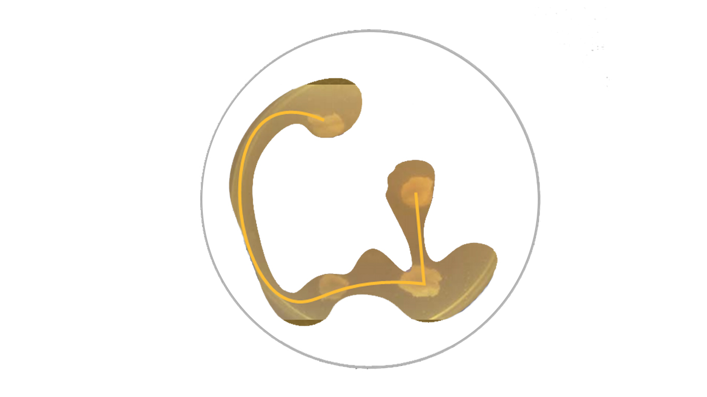
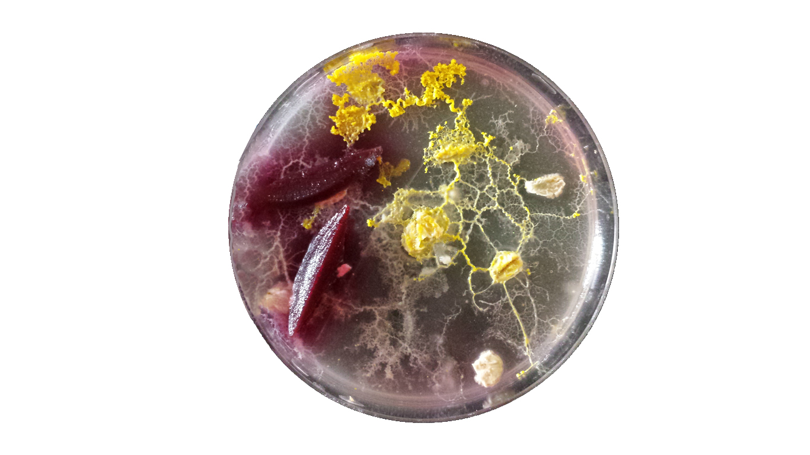
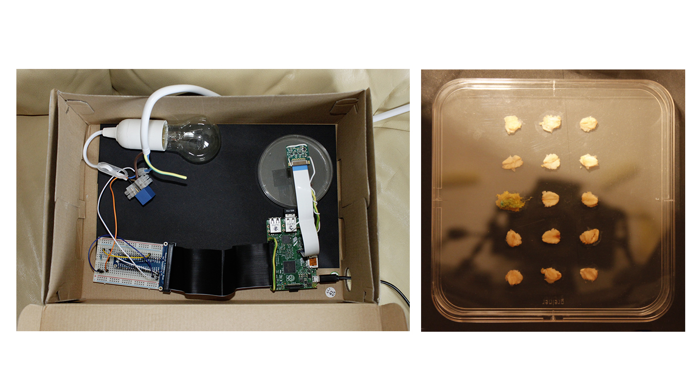
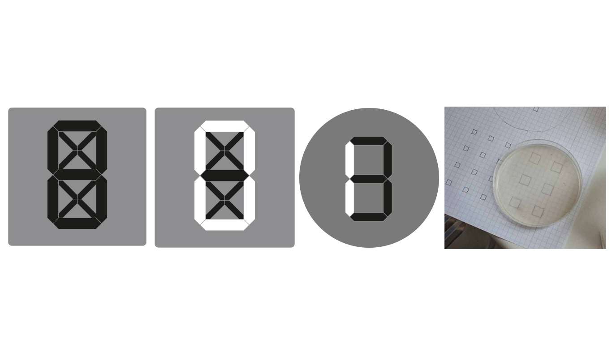

README: [German](README-German.md)/English
#Pille the slim mold

Here you can see the growing history of the slim mold Pille. 

### Abstract:
Pille the slim mold (Physarum polycephalum) is a project. There I try to influent the growing of a slim mold (shape,  color), to create sign with help of the mushroom and record the process in a time laps. After that we try to edit the time Lapps Clip with Processing, OpenCV and try to work out a nice growing visualization.

**1. First experiment with Pille the slim mold:**
    
-  The slim mold grows good in warm temperature above 20 degrees and dark environment  
(It should grow in best conditions about 1 cm per hour)
- Try to control the growing.  
(Tried to control the growing with help of outs but unfortunately I could not see any controlled growing. Maybe the substrate is already a strong influence) 
-  Tried to color the slim mold
(Pille did not adopt the color of the beetroot)  
-  I gave him some distill water to prevent a dry out..

**2. Pille get a new brother and becomes a shooting star:**

-  I boiled glasses with distill water and try to dive Pille into the new glasses
 (Three new glasses with Pilles)
- First try with Raspberry Pi (Really cool) and install the Pi camp.
- After big problems I took some unshar pictures. 
- You have to adjust focus of Pi camp manually (it is really difficult, I do not recommend this) 
- The Pille Brothers were lighted by different light colors. (RGB LED)
 

**3. Pille comes into a Photo lab, try to take pictures without light reflex (DSLR Canon 500D) **

- I have got a 60 W flash. The flash is controlled by a relay and the relay by a Raspberry Pi.
- A box becomes a Photo lab. The location is a dark place at a storeroom.
- The Camp (DSLR) adjustment is really hard to reach in reason of location. (Therefore I recommend work a good solution which is good to reach and adjust but has also good growing contributions)
- Hart time, it is really difficult to take good pictures without light reflection. I tried to reduce reflection with black carton, Paper. I took pictures without the top of the classes but then the slim mold dried out. 
 (Recommendation to do not flash from the top)
- I have not taken a long got shot of my slime mold yet.

### Prerequisite:

[Raspberry Pi](https://www.tinkersoup.de/raspberry-pi/):

-    Raspberry Pi (I have got a Raspberry Pi 2 Modell B 1GB)
-    Micro SDHC card for the Pi(for the system software)  
-    USB power supply 5V (Handy recharge cable )
-    Pi Cobbler (Adafruit Pi T-Cobbler Plus)
-    [Breadboard](http://www.exp-tech.de/komponenten-zubehoer/breadboards/breadboard-830-630-200) and [Jumper Wires](http://www.exp-tech.de/komponenten-zubehoer/kabel/75-pcs-breadboard-jumper-wires-with-m-m-connectors) 
-    HDMI wire (So that you can connect our Raspberrry Pi to your flat screen and operate it with mouse and keyboard)  
-    Patchable (I recommend a Wi-Fi Dongle, makes it much more easier and you are flexible)  

Cameras

-    Pi Cam
-    DSLR CANON NIKON SONY (I have got a CANON 500D)

Relay & Lampe 60w

-    [Relais & Co ](http://www.glacialwanderer.com/hobbyrobotics/?p=9) You need more stuff. You find all the needed material in the followed link (With the help of the instructions you can switch on the 60w lamp. The instructions are for an Arduino but works fin for Raspberry Pi as well.)

Slime molder

-    slime mold (Physarum polycephalum)
-    Petri dish and substrate
-    distilled water 
-    outs or different food sources 

### Installation:

Raspberry Pi

1. Installation des Raspberry Pi. [Follow instructions](https://www.raspberrypi.org/help/noobs-setup/)

2. Connect your Raspberry Pi with [remote control](https://github.com/Johannesproximo/Remote-Desktop-too-Raspberry-Pi/blob/master/README.md) to your Laptop

3. Installation of Raspberry Camp. [Follow instructions](https://www.youtube.com/watch?t=65&v=8xWy3g2QAZ8) It contains a good example of a time-lapse also. The Pi Camp is not convenient for our project, because it is not easy to focus on close objects (Therefor you ne a [tongs and lots of sense] (https://www.youtube.com/watch?v=u6VhRVH3Z6Y)).
4. Installation for DSLR. [Follow instructions of the Repository](https://github.com/topada/DSLR-Timelapse-gphoto-RPI) . By Following the instructions of the Repository I have got an error which I solved in the following instructions so [take a look if you get problems](https://github.com/Johannesproximo/Pille-der-Schleimpilz/blob/master/DSLR-Timelapse-gphoto-RPI-Zusatz.md).
2. Time for the lights:
	3. if you do not use the flash of your DSLR or if you are using the Raspberry Pi Camp, you are able to build lights with [Relays & 60w Lampe](http://www.glacialwanderer.com/hobbyrobotics/?p=9) 
	4. or simply only with LED for the Raspberry Pi Camp

3. Now we have to connect the lights (LED or 60W) to the with Pi and Camp to activate both in the same time. A good description proviedes [this repository](https://github.com/FH-Potsdam/slime-mold-recording-setup).

4. Take some test shots, to see if the pictures are sharp. (Attention ACCU, for a longer time of records with DSLR you have to change the ACCU without changing the position of the DSLR.
5. Now you let the mushroom grow in a Petrischale and try to feet him with different food. Let him grow for since and following the process with the DSLR or Camp.
6. I tried to build since with the mushroom was inspirited by the digital 7 Segments / 15 Segments displays

7. When you have enough pictures you can build a time laps move with Adobe after effects.  

VIDEO >>

8. If you creates a good move with a good quality you can try to create a nice visualization of the process of growing with the help of [Processing](https://processing.org/) connected with [OpenCV](https://github.com/FH-Potsdam/hello-processing-py-cv-world.

### Usage

- Record settings with [Pi Camp](https://www.youtube.com/watch?t=65&v=8xWy3g2QAZ8)
- Record settings with [Pi and DSLR](https://github.com/topada/DSLR-Timelapse-gphoto-RPI)
- Usage of [Adobie After Effects](https://www.youtube.com/watch?v=CRjD3ga7-OI) for time laps.
- Usage of [Processing](https://processing.org/) and [OpenCV](https://github.com/FH-Potsdam/hello-processing-py-cv-world)

### Something else:
I personally was only able to record a partly good clip of the mushroom and was not able to work with it on Open CV.

### Realted Works:

### Thanks:
Thanks to all my friends who took time to implement my algorithm and all my classmates of the Eingabe Ausgabe course summer semester 2015. Especially Fabiantheblind our docent.

### Contact:
In case you have some question or something is not understandable, simply contact me Johannes.Leick@gmx.de have fun.

##Public License
Copyright (C) 2015 Johannes Leick aka JohannesProximo Everyone is permitted to copy and distribute verbatim or modified copies of this license document, and changing it is allowed as long as the name is changed.  
