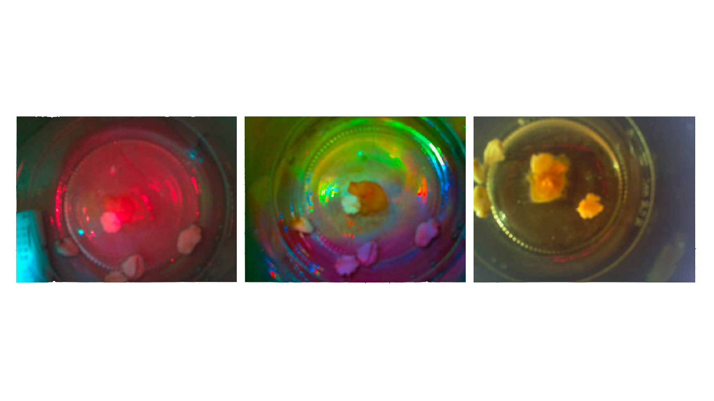

README: German
#Pille der Schleimpilz

Hier sieht man einen Wachstumsverlauf des Pilzes Pille

###Allgemein:
Pille der Schleimpilz (Physarum polycephalum)ist ein Projekt in dem wir versuchen das Wachstum (Form, Farbe) des Pilzes zu beeinflussen und somit Zeichen entstehen zu lassen und dies in einem Zeitraffer festzuhalten. Danach bearbeiten wir diese Video mit Processing, OpenCV und bereiten die Entstehung visuel auf.

**1. Erste Experimentiere mit Pille dem Schleimpilz:**
	
- Der Pilz wächst in Warmen Temperaturen von über 20 grad und dunkler Umgebung gut.  
(Er soll ja bei optimalen bedingungen 1cm pro Stunden wachsen können.)  
- Versuch wachstum zu Steuern.  
(Ich habe ihn mit Haverflocken gelockt allerdings ist die Richtung bis jetzt nicht vorhersehbar und gezieltes wachsen nicht möglich. Vielleicht ist der Närboden schon ein starker einfluss für den Pilz)
-  Versuch den Pilz zu färben
(Er hat die Farbe der Roten bette leider nicht angenommen)  
-  Habe hin und wieder destiliertes Wasser zugegeben um ihn vor dem Ausdrocknen zu schützen.

**2. Pille Bekommt einen Bruder und wird Shootingstar:**

-  Es werden Gläser mit destilierten Wasser abgekocht und versucht den Pilz erneut anzusetzten.  
(In bis zu 3 Gläsern)
- Erste Versuche mit dem Rassberry Pi (super Cool) werden unternommen und versucht die Camera zu installieren.
- Nach großen problemen entstehen erste unscharfe Bilder.
- Der Focus der Pi Camera muss Händisch eingestellt werden.
- Die Pille Brothers wurden mit unterschiedlichem Licht beleuchtet (RGB LED)

**3. Pille kommt ins Fotolabor, versuch einer Spiegelfreien Aufnahme mit DSLR CANON 500D**

- Mein Kamerablitz wird eine 60 Watt Lampe. Geschaltet wird die Lampe mit einem Relay und dem Raspberry Pi.
- Eine Kiste wird zum Aufnahmestudio. Der Ort ist eine Dunkle Warme stelle unter der Decke in unserer Abstellkammer.
- Das Einstellen ist äußerst umständlich da ich schlecht an die DSLR Herankomme. (Daher sollte man von anfang an an einer Kompackten gut zugänglichen Lösung arbeiten...)
- Unentliche Spiegelungen durch die Lampe erschwären die Aufnahme und ich versuche die mit Schwarzen Karton diese zu reduzieren. Dafür wurde auch der Dekel der Pedrischahle entfernt welches den Nährboden ausdrocknen läst ...  
 (es empielt sich die Beleuchtung von der Seite einzubauen so werden reflektionen reduziert)
- Es kam nie zu einem dauerhaften soliden Aufnahme.

###Benötigt:

[Raspberry Pi](https://www.tinkersoup.de/raspberry-pi/):

-	Raspberry Pi (Ich hatte einen Raspberry Pi 2 Modell B 1GB)
-	Micro SDHC Karte für Pi(für das Betriebsystem)  
-	USB Stromversorgung 5V (Handy Ladekabel bzw. Ladenetzteil)
-	Pi Cobbler (Adafruit Pi T-Cobbler Plus)
-	[Breadboard](http://www.exp-tech.de/komponenten-zubehoer/breadboards/breadboard-830-630-200) und [Jumper Wires](http://www.exp-tech.de/komponenten-zubehoer/kabel/75-pcs-breadboard-jumper-wires-with-m-m-connectors) 
-	HDMI Kabel (damit du auch deinen Pi direkt an Bildschirm anschliesen kannst und mit Maus und Tastatur ohne Umwege bedienen)  
-	Patchkabel (Empfehle aber Wifi Dongel. Damit kannst du dann auch über deinen Laptop den Pi Bedienen)  

Cameras

-	Pi Cam
-	DSLR CANON NIKON SONY (Ich hatte eine CANON 500D)

Relai & Lampe 60w

-	[Relais & Co ](http://www.glacialwanderer.com/hobbyrobotics/?p=9) Hier für werden weitere Materialien Benötigt siehe Link(Damit kannst du die 60w Lampe Schalten. Die Anleitung ist fur Arduino funktionerit aber genausogut mit dem Pi)

Schleimpilz

-	Schleimpilz (Physarum polycephalum)
-	Petrischale mit Närboden
-	Destiliertes Wasser
-	Haferflocken oder andere Nahrungsquellen

###Installation:

Raspberry Pi

1. Installation des Raspberry Pi. Folge dafür der [Anleitung im Video](https://www.raspberrypi.org/help/noobs-setup/)

2. Verbinde deinen Raspberry mit einem Laptop +++++++ Fehlt noch ++++++

3. Installiere die Raspberry Camp. [Folge dafür der Anleitung](https://www.youtube.com/watch?t=65&v=8xWy3g2QAZ8) welche sogar eine gute Beispiel zeigt. Diese Camp ist weniger zu empfehlen da sie später nur sehr schwer auf eine bestimmte Entfernung scharfzustellen ist.(Dafür benötigst du eine [Zange und viel Gefühl](https://www.youtube.com/watch?v=u6VhRVH3Z6Y)).
4. Installation für eine DSLR. [In diesem Repository erklärt](https://github.com/topada/DSLR-Timelapse-gphoto-RPI) wird es gut. Ich hatte dabei einen [fehler ich hierin beschreiben und gelöst](https://github.com/Johannesproximo/Pille-der-Schleimpilz/blob/master/DSLR-Timelapse-gphoto-RPI-Zusatz.md) habe.
2. Zeit für die Beleuchtung:
	3. falls du nicht deinen Blitzt der DSLR verwendst oder du etwa mit der Raspberry Camp fotographierst, kannst du dir eine Beleuchtung bauen ob mit [Relais & 60w Lampe ](http://www.glacialwanderer.com/hobbyrobotics/?p=9) 
	4. oder einfach nur mit LED für die Raspberry Camp

3. Nun muss die Beleuchtung und die Camera zusammen geschaltet werden dafür ++++++ Fehlt noch ++++

4. Versuche erste Testbilder zu schießen um zu sehen ob das Bild scharf wird. (ACHTUNG ACCU muss bei einer DSLR bei längerer aufnahme gewechselst werden, dies sollte möglichsein ohne die DSLR zu verrutschen.
5. Nun kannst du dienen Pilz versuchen in deiner Petrischale zu zücketen und ihn mit verschiedenen lockmittel zu verführen umd somit zeichen entstehen zu lassen. Durch die Aufnahme kannst du dies direkt verfolgen.

6. Mein versuch hat sich an an einer 7 Segments bzw. 15 Segments Anzeige ausgerichtet

7. Hast du genügen Bilder geschossen kannst du z.B. mit hilfe von Adobie aftereffects versuchen daraus ein Zeitraffer video zu erstellen.
8. Hast du ein Qalitativ hochwertige Video kannst du nun versuchen mit [Processing](https://processing.org/) verbunden mit [OpenCV](https://github.com/FH-Potsdam/hello-processing-py-cv-world) bestimmte dinge zu tracken und somit das Wachstum visuel darzustellen.

###Anwenden/Benutzen

- Aufnahmeeinstellungen mit Pi camp
- Aufnahmeeinstellungen mit Pi und DSLR
- Verwendung von Adobie after
- Verwendung von Processing mit OpenCV

###Anmerkungen:
Ich persönlich hatte es nur zu einen halbwegs brauchbaren Aufnahme des Pilzes geschaft und konnte das Video leider nicht mehr mit Open CV verarbeiten.

###Verwandte Arbeiten:

###Dank:
Dank geht an alle meine Kommilitonen des Eingabe Ausgabe Kurses des Sommersemester 2015. Gans besonders natürlich Fabiantheblind unseren JEDI Meister.

###Kontakt:
Falls etwas unklar ist und ihr Fragen habt schreibt mir einfach Johannes.Leick@gmx.de
Viel Spaß

##Public License
Copyright (C) 2015 Johannes Leick aka JohannesProximo Everyone is permitted to copy and distribute verbatim or modified copies of this license document, and changing it is allowed as long as the name is changed.
